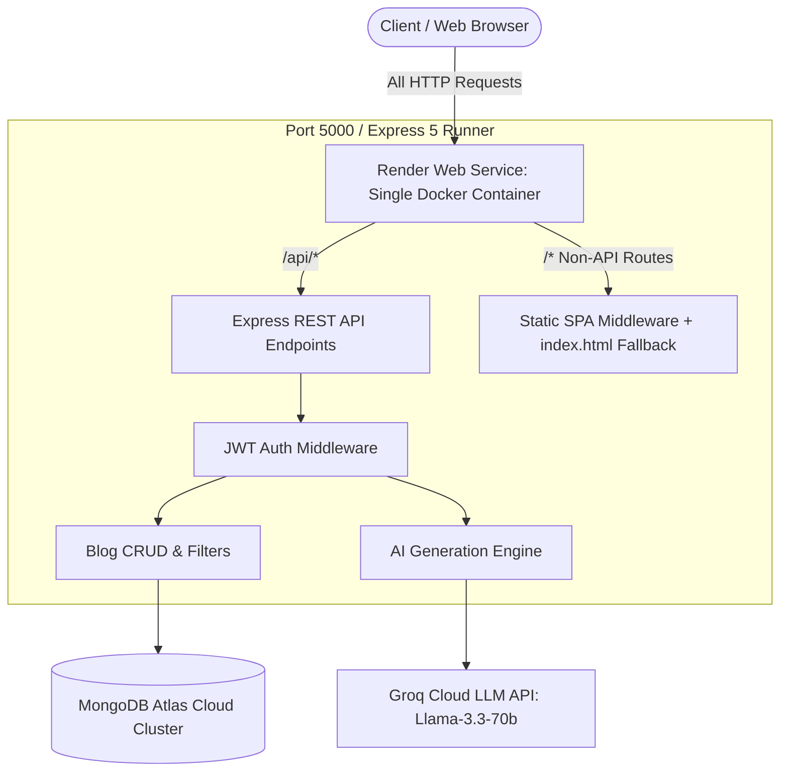

# UTSANOVA Blog Management System

> An enterprise-grade, responsive, full-stack Blog Management Platform featuring a public editorial reading portal, a secured admin dashboard, rich Markdown rendering with GitHub Flavored Markdown (GFM), an AI blog drafting assistant powered by Groq LLM, and single-container multi-stage Docker deployment for cloud hosts like Render.

Developed for **UTSANOVA TECHNOLOGIES PVT. LTD.**  
Website: [www.about.utsanova.com](https://about.utsanova.com) | Email: [hr@utsanova.com](mailto:hr@utsanova.com)

---

## 📑 Table of Contents
- [Architecture & System Overview](#-architecture--system-overview)
- [Technology Stack & Core Libraries](#-technology-stack--core-libraries)
- [Key Features](#-key-features)
- [Single-Container Docker Deployment (Render)](#-single-container-docker-deployment-render)
- [Complete API Documentation](#-complete-api-documentation)
- [Database Schema](#-database-schema)
- [Local Development Setup](#-local-development-setup)
- [Environment Variables](#-environment-variables)
- [Project Directory Structure](#-project-directory-structure)
- [Troubleshooting & Gotchas](#-troubleshooting--gotchas)

---

## 🌟 Architecture & System Overview

The UTSANOVA Blog Platform is engineered as a **unified single-container service** that unifies the React Single Page Application (SPA) and the Express REST API under a single port and domain.



### Why Single-Container Architecture?
- **Cost & Quota Efficiency**: Uses only **1 free Web Service** instance on Render instead of splitting frontend and backend across multiple services.
- **Zero CORS Issues**: Because both the UI assets and `/api` requests originate from the same domain and port, cross-origin resource sharing restrictions are bypassed naturally.
- **Atomic Deployments**: Every `git push` automatically rebuilds both frontend and backend synchronously, eliminating version mismatch bugs.

---

## 🛠️ Technology Stack & Core Libraries

### Frontend
| Library / Tool | Version | Purpose |
| :--- | :--- | :--- |
| **React** | `^19.2.8` | Core UI library using functional components and modern React hooks (`useState`, `useEffect`, `useMemo`). |
| **Vite** | `^8.3.1` | Ultra-fast build tool and bundler for modern web applications. |
| **React Router DOM** | `^7.18.4` | Client-side declarative routing, URL state management, and parameter extraction (`useParams`, `useNavigate`). |
| **Tailwind CSS** | `^4.3.3` | Utility-first styling framework with modern color palettes, CSS variables, and responsive design tokens. |
| **Axios** | `^1.20.0` | Promise-based HTTP client equipped with an automatic request interceptor that injects Bearer JWT authentication tokens. |
| **react-markdown** | `^10.1.0` | Renders Markdown directly as semantic HTML elements. |
| **remark-gfm** | `^4.0.1` | Adds support for GitHub Flavored Markdown (tables, checklists, strikethrough, autolinks). |
| **lucide-react** | `^1.48.0` | Modern, lightweight icon suite for all interactive UI elements. |

### Backend
| Library / Tool | Version | Purpose |
| :--- | :--- | :--- |
| **Node.js** | `v20+ / v24` | JavaScript runtime environment. |
| **Express** | `^5.2.1` | Fast, unopinionated web framework handling REST endpoints and static file serving. |
| **Mongoose** | `^9.10.2` | Elegant Object Data Modeling (ODM) for MongoDB with schemas, validation, and indexing. |
| **jsonwebtoken** | `^9.0.3` | Generates and verifies cryptographically signed JWT tokens for secure admin session authorization. |
| **bcryptjs** | `^3.0.3` | One-way salted cryptographic hashing for administrator passwords. |
| **groq-sdk** | `^1.6.0` | Official client for Groq Cloud API, delivering sub-second LLM inference for blog drafting. |
| **cors** | `^2.8.6` | Configurable Cross-Origin Resource Sharing middleware. |
| **dotenv** | `^18.0.3` | Zero-dependency module that loads environment variables from `.env`. |

---

## ✨ Key Features

### 1. Public Reader Portal
- **Hero & Brand Banner**: UTSANOVA editorial branding with clean typography and gradient styling.
- **Real-Time Live Search**: Instantly searches blog titles, descriptions, content keywords, and tags.
- **Dynamic Tag Filtering**: Click any category pill to filter the feed dynamically.
- **Rich Article Reader**: High-resolution cover images, reading time estimate, publication metadata, and dedicated **Conclusion & Key Takeaways** banner.
- **Full Markdown Rendering**: Clean formatting of headers, bullet points, blockquotes, tables, code snippets, and checklists.

### 2. Admin Dashboard & CMS
- **Real-Time Statistics**: Live counter cards for **Total Articles**, **Published Articles**, and **Draft Articles**.
- **Article Lifecycle Management**: Quick toggling between `Draft` and `Published` directly from the list table.
- **Full CRUD Support**: Add new articles, edit existing ones with live preview, or delete articles with modal confirmation guards.
- **Cover Image Selector**: Custom image URL input with automatic fallback dummy covers and instant preview.

### 3. AI Blog Generation Engine
- **Powered by Groq Cloud**: Uses ultra-fast inference with `llama-3.3-70b-versatile`.
- **Topic-to-Article Generation**: Enter any topic (e.g., *"Event-Driven Microservices in Kubernetes"*).
- **Comprehensive Auto-Generation**: Automatically drafts:
  - An SEO-friendly Title
  - Full structured Markdown Body
  - Curated category Tags
  - An executive Conclusion & Takeaways summary
  - Curated high-resolution Unsplash cover image
- **Human-in-the-Loop**: Generated drafts populate the editing modal so administrators can review, modify, or enhance the content before publishing.

---

## 🐳 Single-Container Docker Deployment (Render)

The project includes a production-ready **Multi-Stage Dockerfile** located at the root of the repository.

### Dockerfile Breakdown

```dockerfile
# Stage 1: Build Frontend (Vite + React)
FROM node:20-alpine AS frontend-builder
WORKDIR /app/frontend
COPY frontend/package*.json ./
RUN npm ci
COPY frontend/ ./
RUN npm run build

# Stage 2: Production Server (Express + Static Assets)
FROM node:20-alpine AS runner
WORKDIR /app
COPY backend/package*.json ./
RUN npm ci --omit=dev
COPY backend/ ./

# Copy compiled React frontend assets into backend/public
COPY --from=frontend-builder /app/frontend/dist ./public

ENV NODE_ENV=production
ENV PORT=5000
EXPOSE 5000

CMD ["node", "server.js"]
```

### How Express 5 Handles Client-Side Routing
Because React Router handles routing on the client side, requesting `/admin`, `/blog/123`, or refreshing any non-root page must return `index.html`. In [backend/server.js](backend/server.js), Express 5 is configured with:

```javascript
// Static frontend serving
const publicDistPath = path.join(__dirname, 'public');
const localDistPath = path.join(__dirname, '../frontend/dist');
const staticPath = fs.existsSync(publicDistPath) ? publicDistPath : (fs.existsSync(localDistPath) ? localDistPath : null);

if (staticPath) {
    app.use(express.static(staticPath));
    // SPA catch-all (Express 5 compatible)
    app.use((req, res, next) => {
        if (req.method === 'GET' && !req.path.startsWith('/api')) {
            return res.sendFile(path.join(staticPath, 'index.html'));
        }
        next();
    });
}
```

---

### Step-by-Step Render Deployment Guide

#### Step 1: Configure MongoDB Atlas Network Access
1. Open [MongoDB Atlas Dashboard](https://cloud.mongodb.com/).
2. Navigate to **Network Access** in the left sidebar.
3. Click **Add IP Address** -> Select **Allow Access from Anywhere** (`0.0.0.0/0`) -> Click **Confirm**.  
   *(Required so Render's dynamic cloud container IPs can connect).*

#### Step 2: Push Your Code to GitHub
Ensure all files are committed and pushed:
```bash
git add .
git commit -m "feat: complete docker containerization and atlas setup"
git push origin main
```

#### Step 3: Create Web Service on Render
1. Log in to [Render Dashboard](https://dashboard.render.com).
2. Click **New +** -> **Web Service**.
3. Choose **Build and deploy from a Git repository** and connect your `BLOG-POST` repository.
4. Fill in the service configuration:
   - **Name**: `utsanova-blog`
   - **Region**: Any (e.g. *Singapore*, *Frankfurt*, or *Oregon*)
   - **Branch**: `main`
   - **Root Directory**: Leave blank (root `./`)
   - **Runtime**: **Docker** *(Render detects the root `Dockerfile` automatically)*
   - **Instance Type**: **Free**

#### Step 4: Add Environment Variables
Scroll to **Environment Variables** and enter:

| Key | Value | Description |
| :--- | :--- | :--- |
| `PORT` | `5000` | Port Express listens on inside the container |
| `MONGO_URI` | `mongodb+srv://<user>:<password>@<cluster>.mongodb.net/utsanova_blog?retryWrites=true&w=majority&appName=Cluster0` | MongoDB Atlas Connection String |
| `JWT_SECRET` | `your_strong_random_jwt_secret_key` | Secret key for signing JWT tokens |
| `GROQ_API_KEY` | `gsk_...` | Groq API Key for AI blog generation |

#### Step 5: Deploy
Click **Create Web Service**. Render will execute the multi-stage build, compile the React UI, launch Node.js, and provide your public HTTPS URL (e.g. `https://utsanova-blog.onrender.com`).

---

## 📡 Complete API Documentation

### Base URL
- **Local Development**: `http://localhost:5000/api`
- **Render Production**: `https://<your-render-subdomain>.onrender.com/api`

---

### 1. System Health Check
Check whether the API is live and accessible.

- **URL**: `/api/health`
- **Method**: `GET`
- **Auth Required**: No
- **Success Response (200 OK)**:
```json
{
  "status": "ok",
  "message": "Utsanova Blog API is running..."
}
```

---

### 2. Authentication Endpoints

#### A. Admin Login
Authenticate an administrator and receive a JWT token.

- **URL**: `/api/auth/login`
- **Method**: `POST`
- **Auth Required**: No
- **Headers**: `Content-Type: application/json`
- **Request Body**:
```json
{
  "email": "admin@utsanova.com",
  "password": "AdminSecurePassword123"
}
```
- **Success Response (200 OK)**:
```json
{
  "token": "eyJhbGciOiJIUzI1NiIsInR5cCI6IkpXVCJ9...",
  "admin": {
    "id": "6740b2a0c841320ef49a1234",
    "email": "admin@utsanova.com"
  }
}
```
- **Error Responses**:
  - `400 Bad Request`: `{"message": "Please provide email and password"}`
  - `401 Unauthorized`: `{"message": "Invalid email or password"}`

#### B. Admin Registration
Register a new administrator account.

- **URL**: `/api/auth/register`
- **Method**: `POST`
- **Auth Required**: No
- **Request Body**:
```json
{
  "email": "newadmin@utsanova.com",
  "password": "StrongPassword!456"
}
```
- **Success Response (201 Created)**:
```json
{
  "message": "Admin registered successfully",
  "admin": {
    "id": "6740b2a0c841320ef49a5678",
    "email": "newadmin@utsanova.com"
  }
}
```

---

### 3. Public Blog Endpoints

#### A. Fetch Published Blogs
Retrieve all published blog posts with optional search, tag filtering, and pagination.

- **URL**: `/api/blogs`
- **Method**: `GET`
- **Auth Required**: No
- **Query Parameters**:
  - `search` *(optional)*: Search string matching title, content, or tags.
  - `tag` *(optional)*: Filter blogs matching a specific tag (e.g. `Cloud`, `React`, `AI`).
  - `page` *(optional, default: 1)*: Page number.
  - `limit` *(optional, default: 6)*: Number of articles per page.
- **Success Response (200 OK)**:
```json
{
  "blogs": [
    {
      "_id": "6740b2a0c841320ef49a0001",
      "title": "Demystifying Microservices with Node.js & Docker",
      "content": "Full article content in markdown format...",
      "tags": ["Node.js", "Docker", "Architecture"],
      "conclusion": "Microservices offer unmatched scalability when containerized properly.",
      "imageUrl": "https://images.unsplash.com/photo-1518770660439-4636190af475?w=800",
      "status": "published",
      "createdAt": "2026-03-29T10:00:00.000Z",
      "updatedAt": "2026-03-29T10:00:00.000Z"
    }
  ],
  "total": 12,
  "page": 1,
  "pages": 2
}
```

#### B. Fetch Single Blog by ID
Retrieve full details of a specific blog post.

- **URL**: `/api/blogs/:id`
- **Method**: `GET`
- **Auth Required**: No
- **Success Response (200 OK)**:
```json
{
  "_id": "6740b2a0c841320ef49a0001",
  "title": "Demystifying Microservices with Node.js & Docker",
  "content": "# Heading\nDetailed markdown content...",
  "tags": ["Node.js", "Docker"],
  "conclusion": "Summary of key takeaways...",
  "imageUrl": "https://images.unsplash.com/photo-1518770660439-4636190af475?w=800",
  "status": "published",
  "createdAt": "2026-03-29T10:00:00.000Z",
  "updatedAt": "2026-03-29T10:00:00.000Z"
}
```
- **Error Response**:
  - `404 Not Found`: `{"message": "Blog not found"}`

---

### 4. Admin Management Endpoints (Protected)

> All admin endpoints require the header:  
> `Authorization: Bearer <your_jwt_token>`

#### A. Fetch All Blogs (Drafts + Published)
- **URL**: `/api/blogs/admin/all`
- **Method**: `GET`
- **Headers**: `Authorization: Bearer <token>`
- **Query Parameters**:
  - `search` *(optional)*: Search query.
  - `status` *(optional)*: Filter by `published` or `draft`.
- **Success Response (200 OK)**:
```json
[
  {
    "_id": "6740b2a0c841320ef49a0001",
    "title": "Upcoming Product Features",
    "status": "draft",
    "tags": ["Internal", "Product"],
    "createdAt": "2026-03-29T11:00:00.000Z"
  }
]
```

#### B. Create a Blog Post
- **URL**: `/api/blogs`
- **Method**: `POST`
- **Headers**: `Authorization: Bearer <token>`, `Content-Type: application/json`
- **Request Body**:
```json
{
  "title": "Securing REST APIs with OAuth2 and JWT",
  "content": "Full markdown body of the article...",
  "tags": ["Security", "API", "JWT"],
  "conclusion": "Always encrypt tokens and store secrets securely.",
  "imageUrl": "https://images.unsplash.com/photo-1550751827-4bd374c3f58b?w=800",
  "status": "published"
}
```
- **Success Response (201 Created)**: Returns the created Blog document.

#### C. Update a Blog Post
- **URL**: `/api/blogs/:id`
- **Method**: `PUT`
- **Headers**: `Authorization: Bearer <token>`, `Content-Type: application/json`
- **Request Body**: Accepts any fields to update (`title`, `content`, `tags`, `conclusion`, `imageUrl`, `status`).
- **Success Response (200 OK)**: Returns the updated Blog document.

#### D. Delete a Blog Post
- **URL**: `/api/blogs/:id`
- **Method**: `DELETE`
- **Headers**: `Authorization: Bearer <token>`
- **Success Response (200 OK)**:
```json
{
  "message": "Blog deleted successfully"
}
```

#### E. AI Blog Drafting Assistant (Groq Cloud)
Generate a comprehensive, structured blog draft from a topic or outline.

- **URL**: `/api/blogs/ai-generate`
- **Method**: `POST`
- **Headers**: `Authorization: Bearer <token>`, `Content-Type: application/json`
- **Request Body**:
```json
{
  "topic": "Event-Driven Architecture in Cloud Systems"
}
```
- **Success Response (200 OK)**:
```json
{
  "title": "Demystifying Event-Driven Architecture in Modern Cloud Systems",
  "content": "## Introduction\nEvent-driven architecture decouples services...\n\n### Core Benefits\n- Scalability\n- Fault isolation...",
  "tags": ["Cloud", "Architecture", "Microservices"],
  "conclusion": "Adopting event-driven patterns empowers systems to scale independently with resilient message brokers.",
  "imageUrl": "https://images.unsplash.com/photo-1451187580459-43490279c0fa?w=800"
}
```

---

## 🗄️ Database Schema

### 1. `Admin` Model ([backend/models/Admin.js](backend/models/Admin.js))
| Field | Type | Attributes | Description |
| :--- | :--- | :--- | :--- |
| `email` | String | Required, Unique, Lowercase, Trim | Admin login email |
| `password` | String | Required | Salted bcrypt hash |
| `createdAt` | Date | Default: `now` | Account creation timestamp |

### 2. `Blog` Model ([backend/models/Blog.js](backend/models/Blog.js))
| Field | Type | Attributes | Description |
| :--- | :--- | :--- | :--- |
| `title` | String | Required, Trim | Article headline |
| `content` | String | Required | Main article body (Markdown supported) |
| `tags` | `[String]` | Array of Strings | Category tags |
| `conclusion`| String | Optional | Executive summary / key takeaways banner |
| `imageUrl` | String | Default: Unsplash tech dummy | Cover image URL |
| `status` | String | Enum: `['draft', 'published']`, Default: `'published'` | Publication state |
| `createdAt` | Date | Automatic timestamps | Creation timestamp |
| `updatedAt` | Date | Automatic timestamps | Last updated timestamp |

---

## 💻 Local Development Setup

### Prerequisites
- Node.js (v18, v20, or v24)
- Git
- MongoDB (Local or Atlas connection)

### 1. Clone Repository
```bash
git clone https://github.com/PARAS-BYTE/BLOG-POST.git
cd BLOG-POST
```

### 2. Configure Backend
Create `backend/.env`:
```env
PORT=5000
MONGO_URI=mongodb+srv://<user>:<password>@cluster0.jtyig2h.mongodb.net/utsanova_blog?retryWrites=true&w=majority&appName=Cluster0
JWT_SECRET=your_super_secret_jwt_key
GROQ_API_KEY=gsk_your_groq_api_key
```

### 3. Seed the Database
Populate the database with the default admin and sample articles:
```bash
cd backend
npm install
node seed.js
```

Default credentials generated:
- **Email**: `admin@utsanova.com`
- **Password**: `AdminSecurePassword123`

### 4. Run Development Servers
Open two terminal windows:

**Terminal 1 (Backend API):**
```bash
cd backend
npm run dev
# Running on http://localhost:5000
```

**Terminal 2 (Frontend UI):**
```bash
cd frontend
npm install
npm run dev
# Running on http://localhost:5173
```

---

## 📁 Project Directory Structure

```text
Blog_System/
├── .dockerignore                 # Excludes node_modules, .env, and dist from Docker context
├── Dockerfile                    # Multi-stage production build (Frontend + Backend)
├── README.md                     # Comprehensive system documentation
│
├── backend/
│   ├── middleware/
│   │   └── authMiddleware.js     # Validates JWT tokens on protected admin routes
│   ├── models/
│   │   ├── Admin.js              # Admin schema with bcrypt password hashing
│   │   └── Blog.js               # Blog schema (title, content, tags, conclusion, status)
│   ├── routes/
│   │   ├── authRoutes.js         # /api/auth (login, register)
│   │   └── blogRoutes.js         # /api/blogs (CRUD, search, /ai-generate)
│   ├── .env                      # Local environment configuration
│   ├── package.json
│   ├── seed.js                   # Pre-populates default admin & published articles
│   └── server.js                 # Express 5 entry point, API routes, & static SPA serving
│
└── frontend/
    ├── public/                   # Static assets & icons
    ├── src/
    │   ├── components/
    │   │   ├── Footer.jsx        # Company footer with branding & links
    │   │   ├── MarkdownRenderer.jsx # Renders markdown with GFM tables & code styling
    │   │   ├── Navbar.jsx        # Navigation bar with responsive links & auth state
    │   │   └── ProtectedRoute.jsx# Guards admin routes from unauthenticated users
    │   ├── pages/
    │   │   ├── AdminDashboard.jsx# Analytics cards, article table, CRUD modal, & AI assistant
    │   │   ├── AdminLogin.jsx    # Secure admin sign-in with quick test credentials
    │   │   ├── AdminRegister.jsx # Administrator account creation
    │   │   ├── BlogDetail.jsx    # Editorial reader view with conclusion callout & tags
    │   │   └── Home.jsx          # Public blog feed with live search & tag filtering
    │   ├── services/
    │   │   └── api.js            # Axios client with JWT interceptor & dynamic baseURL
    │   ├── utils/
    │   │   └── markdownUtils.js  # Reading time calculator & markdown text extractor
    │   ├── App.jsx               # Client router setup & layout wrapper
    │   ├── index.css             # Tailwind v4 configuration & base styles
    │   └── main.jsx              # React root DOM mount
    ├── index.html
    ├── package.json
    └── vite.config.js
```

---

## 🔍 Troubleshooting & Gotchas

### 1. `querySrv ECONNREFUSED` on Windows Local Environment
- **Cause**: Node.js default DNS resolver on some local networks fails to resolve MongoDB Atlas SRV records (`_mongodb._tcp...`).
- **Solution**: Both `backend/server.js` and `backend/seed.js` include explicit Google DNS fallbacks:
  ```javascript
  const dns = require('dns');
  dns.setServers(['8.8.8.8', '8.8.4.4']);
  ```

### 2. Express 5 Wildcard Routing Error (`Missing parameter name at index 1: *`)
- **Cause**: Express 5 upgraded its routing library to `path-to-regexp v8`, which disallows un-named wildcards (`app.get('*', ...)`).
- **Solution**: Handled with standard middleware:
  ```javascript
  app.use((req, res, next) => {
      if (req.method === 'GET' && !req.path.startsWith('/api')) {
          return res.sendFile(path.join(staticPath, 'index.html'));
      }
      next();
  });
  ```

### 3. MongoDB Atlas Connection Timeout on Render
- **Cause**: Atlas Network Access does not permit incoming traffic from Render's cloud servers.
- **Solution**: In MongoDB Atlas -> **Network Access**, ensure `0.0.0.0/0` (Allow access from anywhere) is active.

---

## 📄 License & Credits
Developed by **UTSANOVA TECHNOLOGIES PVT. LTD.**  
© 2026 UTSANOVA TECHNOLOGIES PVT. LTD. All rights reserved.
